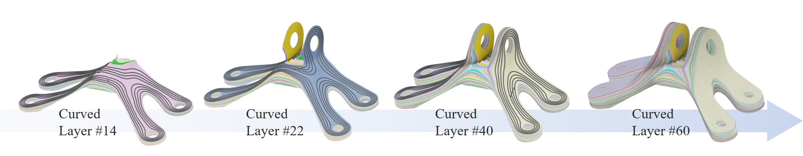

# Spatial Fiber Printing - DataSet
[Project Page](https://guoxinfang.github.io/SpatialFiberPrinting)

## Abstract
This dataset accompanies the technical paper "Exceptional Mechanical Performance by Spatial Printing with Continuous Fiber" by Guoxin Fang, Tianyu Zhang, Yuming Huang, Zhizhou Zhang, Kunal Masania, and Charlie C.L. Wang.

We explore a spatial printing method for fabricating continuous fiber-reinforced thermoplastic composites (CFRTPCs) capable of achieving exceptional mechanical performance. Our computational approach generates 3D toolpaths that fulfill two major reinforcement objectives: 1) aligning with maximal stress directions in critical regions, and 2) interconnecting multiple load-bearing areas with continuous fibers.

## Usage of the Dataset

Each folder, named after a model, contains two sub-folders: 1) 'matrixlayer' - representing layers printed with matrix material, and 2) 'toolpath' - containing waypoints for continuous fiber. The toolpath waypoint format is [x, y, z, nx, ny, nz] + [user-defined parameters].

Toolpaths and curved layers can be visualized using MeshLab software.

Additionally, the provided script "visualizeCCFtoolpath.py" can be used to visualize toolpaths with Python. Please replace 'waypoints_file.txt' with your waypoint file's path in line 55.

Hardware implementation details and robot communication information are available at this [link](https://github.com/yuminghuang1995/Hardware_support_for_Curved_RoboFDM).

